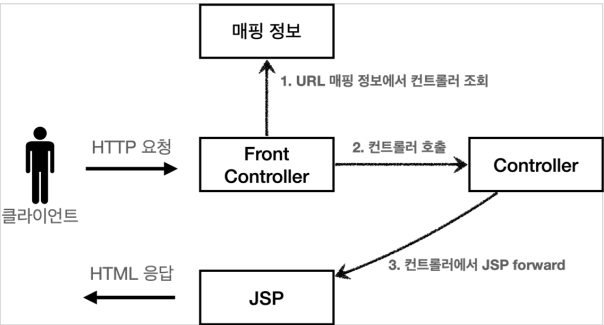

# Model-View-Controller(MVC)

## 등장 배경

1. 너무 많은 역할
   - 서블릿이나 JSP만으로 비지니스 로직과 뷰까지 모두 처리하게되면 너무 많은 역할을 하게되어 유지보수가 어려워진다
   - 비지니스 로직이나 뷰 중 하나를 수정하게 되더라도 모든 부분이 함께있는 코드를 수정해야하며 변경을 원치않는 부분이 변경될 가능성이 있다.

2. 변경의 라이프 사이클
   - 비지니스 로직과 뷰의 변경 라이프 사이클이 다르다는 것이 제일 중요하다
   - UI와 비지니스 로직에 대한 수정은 개별적으로 발생하고 대부분 서로에게 영향을 주지 않는다.
   - 따라서, 라이프 사이클이 다른 대상을 하나의 코드로 관리하는 것은 유지보수에 어려움을 준다.

3. 기능 특화
   - JSP 같은 뷰 템플릿은 화면을 그려주는데 최적화되어 있기 때문에 이런 부분만을 담당하는 것이 효과적이다.

## MVC with Servlet & JSP

- Model(모델)
  - 뷰에 전달할 데이터를 담아두는 곳
  - 비지니스 로직이나 데이터 접근방법을 몰라도 화면을 렌더링하는 부분에 집중할 수 있다
- View(뷰)
  - 모델에 담겨 있는 데이터를 사용해서 화면을 그리는 일에 집중
  - HTML을 생성하는 부분으로 볼 수 있다.
- Controller(컨트롤러)
  - HTTP 요청을 받아서 파라미터를 검증하고 비지니스 로직을 실행한다
  - 뷰에 전달할 결과를 조회하여 모델에 전달한다

> 컨트롤러에 비지니스 로직을 둘 수 있지만, 이런 경우 컨트롤러가 너무 많은 역할을 담당하게된다.
> 그래서 보통 비지니스 로직은 서비스라는 계층을 별도로 만들어서 처리한다.
> 컨트롤러는 비지니스 로직이 있는 서비스를 호출하는 담당이라고 볼 수 있다.

### MVC 적용 실습

　서블릿을 컨트롤로러 사용하고, JSP를 뷰로 사용해서 MVC 패턴을 적용하는 실습.
- 앞서 `HttpServletRequest`에 대해 설명할 때 내부 저장소 기능이 존재하는데, 이 부분이 모델이 된다
  - setAttribute, getAttribute를 통해 데이터를 보관 및 조회 가능하다.
- 컨트롤러와 뷰 로직을 확실히 분리할 수 있으며, 수정이 발생한 로직만을 살펴봄으로써 유지 보수가 용이해졌다.

### 한계

1. `dispatcher.forward()`의 중복
2. dispatcher의 `view path`의 중복
   - prefix: `/WEB-INF/views/`
   - suffix: `.jsp`
3. 사용하지 않는 코드가 존재
   - request나 response 중 사용되지 않거나 둘 다 사용되지 않는 경우가 존재한다
4. 공통 처리가 어렵다
   - 프로젝트가 커질 수록 컨트롤러에서 공통으로 처리해야하는 부분이 증가한다
   - 단순히 메서드로 묶는게 아닌, 이 묶은 메서드를 항상 호출해야되며 이를 관리하는 것에 대한 한계가 존재한다

> 　정리하자면 공통으로 발생하는 문제에 대한 처리가 어렵다는 문제 존재  
> 이를 해결하기 위해, 컨트롤러를 호출하기 전에 먼저 공통 기능을 처리할 수 있는 `Front Controller(프론트 컨트롤러) 패턴`이 필요해졌다.
> 스프링 MVC의 핵심이 `프론트 컨트롤러`에 있다.

---

## MVC framework

### Front Controller Pattern

- 프론터 컨트롤러는 서브릿하나로 클라이언트의 요청을 받는다
- 프론트 컨트롤러가 요청에 맞는 컨트롤러를 찾아서 호출하는 구조를 가진다.
  - 다른 컨트롤러의 로직과 관계없이 자유롭게 호출할 수 있도록 구현.
- 공통 처리가 가능해진다
- 프론트 컨트롤러를 제외한 나머지 컨트롤러는 서블릿을 사용하지 않아도 된다.

> Spring Web MVC의 `DisPatcherServlet`이 `Front Controller`으로 구현되어 있다.

### Front Controller - v1

#### 목표: 기존 코드를 유지하며 프론트 컨트롤러를 도입

1. 모든 HTTP 요청이 front controller로 들어온다
2. URL이 매핑된 정보에서 실행할 컨트롤러를 조회한다
3. Front controller에서 대상 컨트롤러를 호출한다
4. 대상 컨트롤러에서 JSP를 forward 해준다

> 개선에 있어 구조적인 부분과 내부 로직 부분을 분리하여 진행해야한다.  
> 구조 개선을 할 때에는 로직은 건드리지말고 구조에만 먼저 개선하고 정상 동작을 확인한 후, 로직을 개선하자
