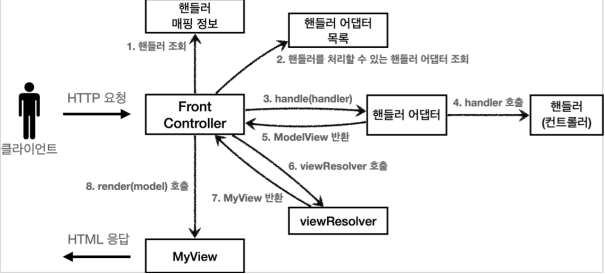
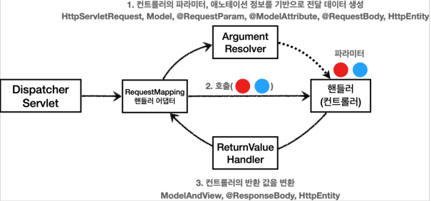

# HTTP 응답

## 정적 리소스와 뷰 템플릿

스프링 서버에서 응답 데이터를 만드는 방법은 크게 3가지이다

1. 정적 리소스 사용
   - 웹 브라우저에 정적인 HTML, css, js를 제공할 때 정적 리소스를 사용한다
   - 파일을 그대로 전달하는 것
2. 뷰 템플릿 사용
   - 웹 브라우저에 `동적인 HTML`을 제공할 때 사용한다
   - Server side rendering
3. HTTP 메시지 사용
   - HTTP API를 제공해서 데이터를 전달하는 방식
   - HTTP 메시지 바디에 JSON 같은 형식으로 데이터를 실어 보낸다
   - Client side rendering

### 정적 리소스

스프링 부트는 클래스 패스의 다음 디렉토리에 있는 정적 리소스를 제공한다

- /static
- /public
- /resources
- /META-INF/resources
- 정적 리소스는 파일 변경없이, 그대로 서비스 하는 것이다

### View Template(뷰 템플릿)

뷰 템플릿을 거쳐 HTML이 동적으로 생성되고, 뷰가 응답을 만들어서 전달한다. 일반적으로 HTML을 동적으로 생성하는 용도로 사용하지만,
다른 것들도 가능하며, 뷰 템플릿이 만들 수 있는 것이라면 뭐든지 가능하다. 뷰 템플릿의 경로는 다음과 같다

- src/main/resources/templates

#### String을 반환하는 경우

- `@ResponseBody`가 없는 `@Controller`의 경우 `response/hello`로 뷰 리졸버가 실행되어서 뷰를 찾고 렌더링 한다.
- `@ResponseBody`가 있따면 HTTP 메시지 바디에 직접 문자가 입력된다!!

#### Void를 반환하는 경우

- `@Controller`를 사용하고 `HttpServletResponse, OutputStream(Writer)` 같은 HTTP 메시지 바디를 처리하는 파라미터가 없다면
요청 URL을 참고해서 논리 뷰 이름으로 사용된다
- 명시성이 떨어지기 때문에 권장하지 않는 방법이다.

## HTTP API, 메시지 바디에 직접 입력하는 방법

- [response http api](/springmvc/basic/response/ResponseBodyController.java)
- `@RestController = @ResponseBody + @Controller`
  - 모든 컨트롤러에 `@ResponseBody`를 적용한다
  - HTTP 메시지 바디에 직접 데이터를 입력한다
  - 말 그대로 `Rest API`를 만들때 사용하는 컨트롤러이다.

## HTTP 메시지 컨버터

`@RequestBody`, `@ResponseBody`를 사용하게 되면

- HTTP의 Body에 문자 내용을 직접 반환
- `viewResolver` 대신에 `HttpMessageConverter`가 동작한다
- 기본 문자 처리
  - `StringHttpMessageConverter`
- 기본 객체 처리
  - `MappingJackson2HttpMessageConverter`
- byte 처리 등등 여러가지 `HttpMessageConverter`가 기본적으로 등록되어 있다
  - 0 = ByteArrayHttpMessageConverter
    - 클래스 타입:`byte[]`, 미디어 타입: `*/*`
    - 쓰기 미디어 타입: `application/octet-stream`
  - 1 = StringHttpMessageConverter
    - 클래스 타입:`String`, 미디어 타입: `*/*`
    - 쓰기 미디어 타입: `text/plain`
  - 2 = MappingJackson2HttpMessageConverter
    - 클래스 타입: 객체 또는 `HashMap`, 미디어 타입: `application/json`
    - 쓰기 미디어 타입: `application/json`
  - 일부 생략
  - 대상의 `클래스 타입과 미디어 타입` 두 개를 체크해서 사용여부를 결정한다
- `HttpMessageConverter`는 HTTP 요청, 응답 모두에서 사용된다!

스프링 MVC는 다음의 경우에 `HttpMessageConverter`를 적용한다

- HTTP 요청
  - `@RequestBody`
  - `HttpEntity(RequestEntity)`
  - Http 요청의 Content-type 미디어 타입을 지원하는가!
- HTTP 응답
  - `@ResponseBody`
  - `HttpEntity(ResponseEntity)`
  - Http 요청의 Accept 미디어 타입을 지원하는가!
    - 정확하게는 `@RequestMapping의 produces`

## RequestMapping Handler Adapter

[Message Converter](../response/README.md)는 어디쯤에서 동작할까?

- `@RequestMapping`을 처리하는 핸들러 어댑터인 `RequestMappingHandlerAdapter`에 집중할 필요가 있다

### Argument Resolver

- 어노테이션 기반 컨트롤러는 다양한 파라미터를 사용 가능하다
    - `HttpServletRequest`, `Model`, `@RequestParam`, `@ModelAttribute` 등등
- `RequestMappingHandlerAdpater`가 `Argument Resolver`를 호출해서 컨트롤러에서 필요한 다양한 값을 생성한다.
- 이렇게 해서 모든 파라미터의 값(객체)들이 준비되면 `RequestMappingHandlerAdpater`가 컨트롤러를 호출하면서 생성된 값을 컨트롤러에 넘겨준다
- 즉, 컨트롤러의 파라미터, 어노테이션 정보를 기반으로 전달 데이터를 생성한다

### Return Value Handler

- `HandlerMethodReturnValueHandler`
- `ArgumentResolver`와 비슷한데, 이 핸들러는 응답 값을 변환하고 처리해준다
- 즉, 컨트롤러의 반환 값을 변환해주는 핸들러

### 그래서 MessageConverter는 어디에?

`MessageConverter`는 결국 `@RequestBody`나 `@ResponseBody` 컨트롤러가 필요로하는 파라미터 값에 사용된다.
즉, `ArgumentResolver`와 `ReturnValueHandler`에서 동작한다는 말이다.

- 요청의 경우
    - `@RequestBody`나 `HttpEntity`등을 처리하는 `ArgumentResolver`가 각각 존재한다.
    - 이런 `ArgumentResolver`들이 `MessageConverter`를 사용해서 필요한 객체를 생성하게 된다.
- 응답의 경우
    -  `@ResponseBody`나 `HttpEntity`등을 처리하는 `ReturnValueHandler`가 각각 존재한다.